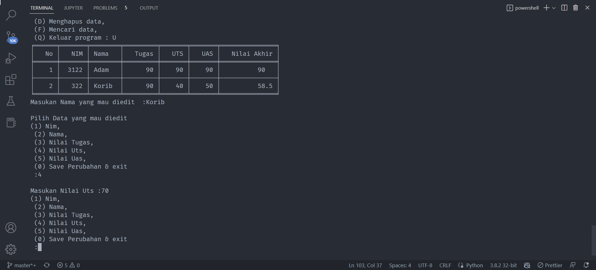

## Latihan  OOP pada python menggunakan class dan menginstansiasi sebuah class lalu  membuat program crud sederhana dengan class

### Repository ini dibuat sebagai tugas kuliah bahasa pemrogramman

1. Pertama kita buat buat folder `12-oop` dan didalam kita buat file bernama `Praktikum.py`

      

2. Kita akan buat program crud sederhana dan berikut `flowchart` dan `class diagram` program yang akan dibuat.

      flowchart :

      

      class diagram :

      

3. Lalu buka file `Praktikum.py` dan masukan codingan sebagai berikut, lalu run dengan mengetikan perintah berikut diterminal `python Praktikum.py`:

      

      dan Berikut hasilnya :

      Jika memilih opsi `C = menambah data` maka akan tampil sebagai berikut :

      

      Jika memilih opsi `R = Melihat semua data` maka akan tampil sebagai berikut :

      

      Jika memilih opsi `U = mengupdate data` maka akan tampil sebagai berikut :

      

      Jika memilih opsi `D = Menghapus data` maka akan tampil sebagai berikut :

      

      Jika memilih opsi `Q = Keluar Program` maka akan tampil sebagai berikut :

      

### selesai. seperti itulah program crud sederhana yang kita buat, menggunakan class pada python

[sawer](https://saweria.co/adamwebdev)

